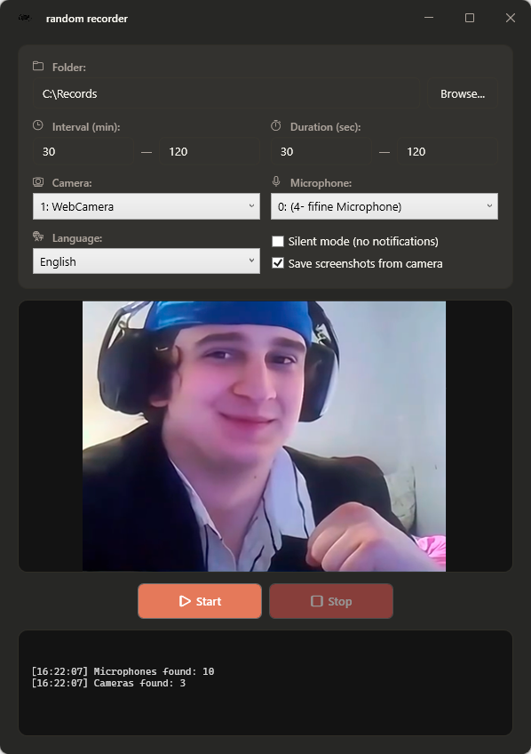
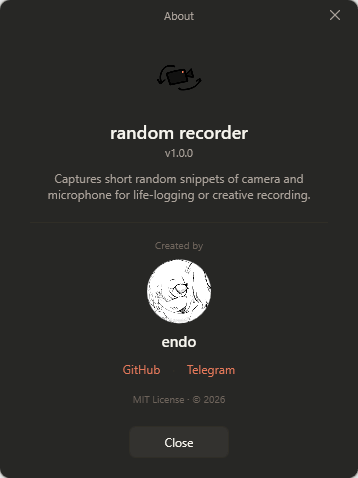

<p align="center">
  
</p>

<h1 align="center">Random Recorder 🎥</h1>

<p align="center"><i>Captures short random snippets of camera and microphone for life-logging or creative recording.</i></p>

<p align="center"><b><a href="#english">English</a> • <a href="#русский">Русский</a></b></p>

---

## English

Random Recorder runs quietly in the background. At random intervals it records a short clip from your webcam and microphone, then waits for the next one. Perfect for:

- **Life-logging** — capture authentic, unposed moments throughout the day
- **Creative projects** — generate raw material for collages, video diaries, or art
- **Self-observation** — see how you actually look and sound when you're not "on"

### ✨ Features

- 🎲 Recordings trigger at random times within a range you set (e.g. every 30–120 minutes)
- 🎬 Each recording lasts a random duration (e.g. 30–120 seconds)
- 📸 Optional screenshot capture alongside each video
- 🎥 Pick your camera and microphone from any connected device
- 🔴 Live preview with a REC indicator and on-screen timer while recording
- 🎮 **"Find the Recording" game mode** — the app hides a recording somewhere on your computer and you race to find it using hints before time runs out 🪿
- 🌍 Available in English and Russian (auto-detected by system, switchable in UI)
- 💾 All settings persist between launches
- 📦 Single portable `.exe` — everything is bundled inside, including ffmpeg

### 🎮 Game mode: "Find the Recording"

Press **Play** instead of Start, and Random Recorder turns into a hide-and-seek game: it records a clip and hides the file in a random folder on your PC. A timer and a trail of hints help you track it down — drag the file onto the timer to win. Run out of time and the goose shows up to claim it. You can set the time limit yourself before each round.

### 📸 Screenshots

<p>
  
  
</p>

### 📥 Installation

1. Go to the [Releases page](https://github.com/endo00o/RandomRec/releases) and download `RandomRec.exe` from the latest release.
2. Run it — that's it.

Everything (including ffmpeg and the .NET runtime) is bundled inside the single `.exe`, so there's nothing else to download or install.

> ⚠️ Requires Windows 10 or later.

### 🚀 Usage

1. Pick a folder where recordings will be saved.
2. Set the interval range (in minutes) between recordings.
3. Set the duration range (in seconds) for each recording.
4. Choose your camera and microphone.
5. Hit **Start** — the first recording begins immediately, then random ones follow. Hit **Stop** to end the session.
6. Or hit **Play** to launch the **"Find the Recording"** game mode.

Recordings are saved as `.mp4` files with timestamped names like `rec_2026-05-24_14-32-18.mp4`. Screenshots (if enabled) are saved alongside as `.png`.

### 🛠️ Building from source

Requires:
- Visual Studio 2022 with the **.NET desktop development** workload
- .NET 8 SDK

The repository does **not** include `ffmpeg.exe` (it gets embedded into the build), so download it first — the `release-essentials` build from [gyan.dev](https://www.gyan.dev/ffmpeg/builds/) is enough — and place `ffmpeg.exe` in the `RandomRec` project folder.

Then open `RandomRec.csproj` in Visual Studio and build, or produce a single-file release from the command line:

```bash
dotnet publish -c Release -r win-x64 --self-contained true
```

The build appears in `bin/Release/net8.0-windows/win-x64/publish/`.

### 🧰 Tech stack

- C# / WPF (.NET 8)
- [OpenCvSharp](https://github.com/shimat/opencvsharp) — camera capture (preview & screenshots)
- [NAudio](https://github.com/naudio/NAudio) — microphone capture and the goose honk
- [DirectShowLib](https://github.com/Sascha-L/WPF-MediaKit) — enumerating real device names
- [ffmpeg](https://ffmpeg.org/) — recording and muxing into MP4 (bundled)

### 📄 License

[MIT](https://github.com/endo00o/RandomRec/blob/main/LICENSE) © 2026 endo

### 👤 Author

Made by **endo** — find me on [GitHub](https://github.com/endo00o) or [Telegram](https://t.me/endo0_0).

---

## Русский

Random Recorder тихо работает в фоне. Через случайные промежутки времени он записывает короткий фрагмент с веб-камеры и микрофона, а затем ждёт следующего. Идеально для:

- **Лайфлоггинга** — ловить настоящие, непостановочные моменты в течение дня
- **Творческих проектов** — сырьё для коллажей, видеодневников или арта
- **Самонаблюдения** — увидеть, как ты выглядишь и звучишь, когда не «в кадре»

### ✨ Возможности

- 🎲 Записи запускаются в случайные моменты внутри заданного диапазона (например, каждые 30–120 минут)
- 🎬 Каждая запись длится случайное время (например, 30–120 секунд)
- 📸 Опциональные скриншоты вместе с каждым видео
- 🎥 Выбор камеры и микрофона из любого подключённого устройства
- 🔴 Живое превью с индикатором REC и таймером во время записи
- 🎮 **Игровой режим «Найди запись»** — приложение прячет запись где-то на компьютере, а ты ищешь её по подсказкам, пока не вышло время 🪿
- 🌍 Доступно на русском и английском (определяется по системе, переключается в интерфейсе)
- 💾 Все настройки сохраняются между запусками
- 📦 Единый переносимый `.exe` — всё внутри, включая ffmpeg

### 🎮 Игровой режим «Найди запись»

Нажми **Играть** вместо «Старт», и Random Recorder превращается в игру в прятки: он записывает фрагмент и прячет файл в случайную папку на ПК. Таймер и цепочка подсказок помогают его выследить — перетащи файл на таймер, чтобы победить. Не успеешь — придёт гусь и заберёт запись. Время на поиск можно задать самому перед каждым раундом.

### 📸 Скриншоты

<p>
  
  
</p>

### 📥 Установка

1. Открой [страницу Releases](https://github.com/endo00o/RandomRec/releases) и скачай `RandomRec.exe` из последнего релиза.
2. Запусти — и всё.

Всё (включая ffmpeg и среду .NET) встроено в один `.exe`, так что больше ничего скачивать или устанавливать не нужно.

> ⚠️ Требуется Windows 10 или новее.

### 🚀 Использование

1. Выбери папку, куда будут сохраняться записи.
2. Задай диапазон интервала (в минутах) между записями.
3. Задай диапазон длительности (в секундах) для каждой записи.
4. Выбери камеру и микрофон.
5. Нажми **Старт** — первая запись начнётся сразу, затем пойдут случайные. Нажми **Стоп**, чтобы завершить.
6. Либо нажми **Играть**, чтобы запустить игровой режим **«Найди запись»**.

Записи сохраняются как `.mp4` с именами по времени, например `rec_2026-05-24_14-32-18.mp4`. Скриншоты (если включены) сохраняются рядом как `.png`.

### 🛠️ Сборка из исходников

Требуется:
- Visual Studio 2022 с компонентом **«Разработка классических приложений .NET»**
- .NET 8 SDK

В репозитории **нет** `ffmpeg.exe` (он встраивается в сборку), поэтому сначала скачай его — достаточно сборки `release-essentials` с [gyan.dev](https://www.gyan.dev/ffmpeg/builds/) — и положи `ffmpeg.exe` в папку проекта `RandomRec`.

Затем открой `RandomRec.csproj` в Visual Studio и собери, или сделай единый файл из командной строки:

```bash
dotnet publish -c Release -r win-x64 --self-contained true
```

Результат появится в `bin/Release/net8.0-windows/win-x64/publish/`.

### 🧰 Стек

- C# / WPF (.NET 8)
- [OpenCvSharp](https://github.com/shimat/opencvsharp) — захват камеры (превью и скриншоты)
- [NAudio](https://github.com/naudio/NAudio) — захват микрофона и honk гуся
- [DirectShowLib](https://github.com/Sascha-L/WPF-MediaKit) — получение настоящих имён устройств
- [ffmpeg](https://ffmpeg.org/) — запись и сборка в MP4 (встроен)

### 📄 Лицензия

[MIT](https://github.com/endo00o/RandomRec/blob/main/LICENSE) © 2026 endo

### 👤 Автор

Сделано **endo** — я в [GitHub](https://github.com/endo00o) и [Telegram](https://t.me/endo0_0).
